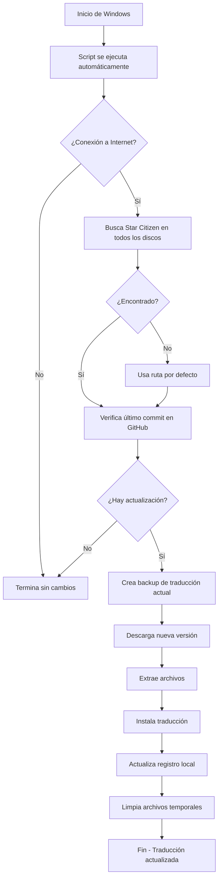

# 🌐 Star Citizen - Traducción al Español

<div align="center">


**Traducción colaborativa al español de Star Citizen con sistema de actualización automática**

[🚀 Instalación Rápida](#-instalación) · [📖 Documentación](#-cómo-funciona) · [❓ FAQ](#-preguntas-frecuentes) · [🐛 Reportar Problema](https://github.com/Thord82/Star_citizen_ES/issues)

</div>

---

## 📋 Contenido

- [Características](#-características)
- [Requisitos](#-requisitos)
- [Instalación](#-instalación)
  - [Método 1: Instalación Automática](#método-1-instalación-automática-recomendada)
  - [Método 2: Instalación Manual](#método-2-instalación-manual)
- [Cómo Funciona](#-cómo-funciona)
- [Verificación](#-verificación)
- [Gestión del Sistema](#-gestión-del-sistema)
- [Estructura del Proyecto](#-estructura-del-proyecto)
- [Solución de Problemas](#-solución-de-problemas)
- [Preguntas Frecuentes](#-preguntas-frecuentes)
- [Contribuir](#-contribuir)
- [Licencia](#-licencia)

---

## ✨ Características

- 🔄 **Actualización Automática** - Se actualiza al iniciar Windows sin intervención manual
- 🔍 **Detección Inteligente** - Encuentra Star Citizen automáticamente en cualquier disco (C: a Z:)
- 💾 **Backup Automático** - Crea respaldo antes de cada actualización
- 📊 **Registro Detallado** - Log completo de todas las operaciones
- ⚡ **Eficiente** - Solo descarga cuando hay cambios nuevos
- 🔒 **Seguro** - Verifica integridad y conectividad antes de actualizar
- 🎯 **Silencioso** - Funciona en segundo plano sin interrumpir

---

## 💻 Requisitos

- **Sistema Operativo:** Windows 10 (1809+) o Windows 11
- **Permisos:** Derechos de administrador para la instalación
- **Conectividad:** Conexión a Internet activa
- **Software:** PowerShell 5.1+ (incluido en Windows)
- **Espacio:** ~50MB libres para archivos temporales

---

## 🚀 Instalación

### Método 1: Instalación Automática (Recomendada)

1. **Descarga los archivos necesarios:**
   - `InstalarAutoUpdate.bat`
   - `UpdateStarCitizenES.bat`
   - `UpdateStarCitizenES.xml`

2. **Ejecuta el instalador:**
   - Haz clic derecho en `InstalarAutoUpdate.bat`
   - Selecciona **"Ejecutar como administrador"**
   - Espera a que termine la instalación

3. **¡Listo!** El sistema está configurado y funcionando

```cmd
# El instalador automático:
# ✓ Crea la carpeta C:\Scripts\
# ✓ Copia el script de actualización
# ✓ Configura la tarea programada
# ✓ Verifica que todo funcione correctamente
```

### Método 2: Instalación Manual

#### Paso 1: Preparar el Script

1. Crea la carpeta `C:\Scripts\` (si no existe)
2. Copia `UpdateStarCitizenES.bat` a `C:\Scripts\`

#### Paso 2: Configurar Tarea Programada

**Opción A: Importar XML**

1. Abre **Programador de tareas** (`Win + S` → escribe "Programador de tareas")
2. Click derecho en el panel izquierdo → **"Importar tarea..."**
3. Selecciona `UpdateStarCitizenES.xml`
4. Verifica que la ruta del script sea correcta
5. Introduce tu contraseña si se solicita
6. Click en **Aceptar**

**Opción B: Crear Manualmente**

```cmd
schtasks /create /tn "UpdateStarCitizenES" /tr "C:\Scripts\UpdateStarCitizenES.bat" /sc onlogon /rl highest /f
```

---

## 🔧 Cómo Funciona

### Flujo de Actualización



### Ubicaciones de Búsqueda

El script busca Star Citizen en estas rutas (en todos los discos):

```
[Disco]:\Program Files\Roberts Space Industries\StarCitizen\LIVE\data\Localization\spanish_(spain)
[Disco]:\StarCitizen\LIVE\data\Localization\spanish_(spain)
[Disco]:\Roberts Space Industries\StarCitizen\LIVE\data\Localization\spanish_(spain)
[Disco]:\Games\StarCitizen\LIVE\data\Localization\spanish_(spain)
```

### Archivos Generados

| Archivo | Ubicación | Descripción |
|---------|-----------|-------------|
| `Star_citizen_ES_last_commit.txt` | `%USERPROFILE%` | Registra el último commit instalado |
| `Star_citizen_ES_update_log.txt` | `%USERPROFILE%` | Log detallado de operaciones |
| Backup | `[Ruta del juego]_backup_YYYYMMDD` | Copia de seguridad anterior |

---

## ✅ Verificación

### Comprobar que está instalado

```cmd
# Ver información de la tarea
schtasks /query /tn "UpdateStarCitizenES" /fo LIST /v

# Ver si el script existe
dir C:\Scripts\UpdateStarCitizenES.bat
```

### Probar el sistema

**Método 1: Ejecutar manualmente**
```cmd
schtasks /run /tn "UpdateStarCitizenES"
```

**Método 2: Reiniciar Windows**
- Reinicia tu PC
- El script se ejecutará automáticamente

**Método 3: Ejecutar el script directamente**
```cmd
C:\Scripts\UpdateStarCitizenES.bat
```

### Revisar el Log

```cmd
# Abrir el log con el Bloc de notas
notepad %USERPROFILE%\Star_citizen_ES_update_log.txt

# O ver las últimas líneas en PowerShell
Get-Content $env:USERPROFILE\Star_citizen_ES_update_log.txt -Tail 20
```

---

## 🛠️ Gestión del Sistema

### Comandos Útiles

```cmd
# Ejecutar actualización ahora
schtasks /run /tn "UpdateStarCitizenES"

# Desactivar temporalmente
schtasks /change /tn "UpdateStarCitizenES" /disable

# Reactivar
schtasks /change /tn "UpdateStarCitizenES" /enable

# Ver estado
schtasks /query /tn "UpdateStarCitizenES"

# Ver última ejecución
schtasks /query /tn "UpdateStarCitizenES" /fo LIST /v | findstr "Última"
```

### Modificar Configuración

**Cambiar horario de ejecución:**

1. Abre **Programador de tareas**
2. Busca `UpdateStarCitizenES`
3. Clic derecho → **Propiedades**
4. Pestaña **Desencadenadores** → Editar o Nuevo
5. Configura según tus preferencias

**Ejemplo: Ejecutar diariamente a las 3:00 AM**
```cmd
schtasks /change /tn "UpdateStarCitizenES" /tr "C:\Scripts\UpdateStarCitizenES.bat" /sc daily /st 03:00
```

---

## 📁 Estructura del Proyecto

```
Star_citizen_ES/
├── 📄 README.md                      # Este archivo
├── 📜 UpdateStarCitizenES.bat        # Script principal de actualización
├── 📋 UpdateStarCitizenES.xml        # Configuración de tarea programada
├── 🚀 InstalarAutoUpdate.bat         # Instalador automático
├── 📦 Star_citizen_ES.zip            # Archivos de traducción (releases)
└── 📖 docs/
    ├── INSTALL.md                    # Guía detallada de instalación
    ├── TROUBLESHOOTING.md            # Solución de problemas
    └── CONTRIBUTING.md               # Guía de contribución
```

---

## 🔍 Solución de Problemas

### El script no se ejecuta al iniciar

**Solución:**
```cmd
# Verificar que la tarea existe
schtasks /query /tn "UpdateStarCitizenES"

# Recrear la tarea
schtasks /delete /tn "UpdateStarCitizenES" /f
schtasks /create /tn "UpdateStarCitizenES" /tr "C:\Scripts\UpdateStarCitizenES.bat" /sc onlogon /rl highest /f
```

### No encuentra Star Citizen

**Solución manual:**

1. Abre `C:\Scripts\UpdateStarCitizenES.bat` con el Bloc de notas
2. Busca la sección `:found`
3. Añade tu ruta personalizada antes de esa línea:

```batch
if exist "X:\TuRutaPersonalizada\StarCitizen\LIVE\data" (
    set "DEST_DIR=X:\TuRutaPersonalizada\StarCitizen\LIVE\data\Localization\spanish_(spain)"
    goto :found
)
```

### Error de permisos

**Solución:**
```cmd
# Ejecutar como administrador
runas /user:Administrator "C:\Scripts\UpdateStarCitizenES.bat"

# O modificar permisos de la carpeta
icacls "C:\Scripts" /grant %USERNAME%:F /T
```

### No hay conexión a GitHub

**Verificar conectividad:**
```cmd
ping github.com
curl -I https://api.github.com/repos/Thord82/Star_citizen_ES/commits
```

### Log muestra errores

Revisa el log completo:
```cmd
notepad %USERPROFILE%\Star_citizen_ES_update_log.txt
```

Errores comunes:
- `Sin conexión a internet` → Verifica tu conexión
- `No se pudo obtener info de GitHub` → GitHub puede estar caído
- `Falló la descarga` → Verifica espacio en disco
- `Falló al expandir` → El ZIP puede estar corrupto

---

## ❓ Preguntas Frecuentes

### ¿Necesito configurar algo manualmente?

No. El script detecta automáticamente la ubicación de Star Citizen en todos los discos duros. Solo en casos muy específicos con rutas personalizadas necesitarías editar el script.

### ¿Qué pasa si Star Citizen ya está actualizado?

El script verifica el último commit de GitHub. Si ya tienes la última versión, termina inmediatamente sin descargar nada ni modificar archivos.

### ¿Consume muchos recursos?

No. El script tarda entre 5-30 segundos dependiendo de si hay actualización. Solo usa recursos cuando se ejecuta y se cierra inmediatamente después.

### ¿Puedo desactivarlo temporalmente?

Sí:
```cmd
schtasks /change /tn "UpdateStarCitizenES" /disable
```

### ¿Cómo restauro un backup?

Los backups se guardan en carpetas con fecha. Para restaurar:

1. Ve a la carpeta del juego
2. Busca carpetas tipo `spanish_(spain)_backup_20251217`
3. Copia el contenido de vuelta a `spanish_(spain)`

### ¿Funciona con versiones PTU/EPTU?

El script está configurado para la versión LIVE. Para PTU, edita el script y cambia `\LIVE\` por `\PTU\`.

### ¿Afecta al rendimiento del juego?

No. La traducción son solo archivos de texto que el juego carga. No afecta al rendimiento.

### ¿Puedo usar esto en varios PCs?

Sí. Instala en cada PC donde juegues Star Citizen.

---

## 🤝 Contribuir

¡Las contribuciones son bienvenidas! Si quieres ayudar a mejorar la traducción o el sistema de actualización:

### Reportar Problemas

1. Ve a [Issues](https://github.com/Thord82/Star_citizen_ES/issues)
2. Busca si ya existe un reporte similar
3. Si no, crea uno nuevo con:
   - Descripción detallada del problema
   - Pasos para reproducirlo
   - Log del script (si aplica)
   - Versión de Windows

### Mejorar la Traducción

1. Fork este repositorio
2. Crea una rama para tus cambios (`git checkout -b mejora/descripcion`)
3. Edita los archivos de traducción
4. Commit tus cambios (`git commit -m 'Mejora: descripción'`)
5. Push a tu fork (`git push origin mejora/descripcion`)
6. Abre un Pull Request

### Mejorar el Script

Si tienes ideas para mejorar el sistema de actualización, abre un Issue o Pull Request con tu propuesta.

---

## 📜 Licencia

Este proyecto está bajo la Licencia MIT. Ver el archivo [LICENSE](LICENSE) para más detalles.

---

## 👥 Créditos

- **Comunidad Star Citizen ES** - Por la traducción colaborativa
- **Thord82** - Mantenimiento del repositorio
- **Contribuidores** - Ver [Contributors](https://github.com/Thord82/Star_citizen_ES/graphs/contributors)

---

## 🔗 Enlaces Útiles

- [Thord82 en GitHub](https://github.com/Thord82/Star_citizen_ES)

---

<div align="center">

**¿Te ha sido útil este proyecto?** ⭐ Dale una estrella al repo

**¿Encontraste un problema?** 🐛 [Repórtalo aquí](https://github.com/Thord82/Star_citizen_ES/issues)

**¿Quieres contribuir?** 🤝 [Lee la guía de contribución](#-contribuir)

---

Hecho con ❤️ por la comunidad de Star Citizen España

</div>