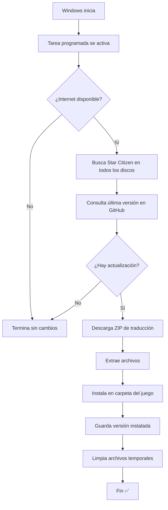

# 🌐 Star Citizen - Traducción al Español (Sistema de Auto-Actualización)

<div align="center">


**Sistema de actualización automática para la traducción al español de Star Citizen**

[🚀 Instalación](#-instalación-rápida) · [📖 Características](#-características) · [❓ FAQ](#-preguntas-frecuentes) · [🐛 Reportar Problema](https://github.com/Raksiusdev/SC-LangUPD_ES/issues)

</div>

---

## 📋 ¿Qué es esto?

Este es un **sistema de actualización automática** que mantiene tu traducción al español de Star Citizen siempre actualizada sin que tengas que hacer nada.

### 🎯 Lo que hace:

- ✅ **Detecta automáticamente** dónde tienes instalado Star Citizen (en cualquier disco: C:, D:, E:, etc.)
- ✅ **Verifica actualizaciones** desde el repositorio oficial de traducción
- ✅ **Descarga e instala** solo cuando hay versiones nuevas
- ✅ **Se ejecuta automáticamente** cada vez que inicias Windows
- ✅ **Funciona en segundo plano** sin interrumpir tu trabajo
- ✅ **Guarda un log** de todas las operaciones

---

## ✨ Características

| Característica | Descripción |
|----------------|-------------|
| 🔍 **Detección Inteligente** | Encuentra Star Citizen en todos los discos automáticamente |
| 🔄 **Actualización Automática** | Se ejecuta al iniciar Windows sin intervención |
| 📊 **Log Detallado** | Registro completo de todas las operaciones |
| ⚡ **Eficiente** | Solo descarga cuando detecta cambios |
| 🎮 **Compatible** | Funciona con instalaciones en cualquier ubicación |
| 🔒 **Seguro** | Código abierto y auditable |

---

## 🚀 Instalación Rápida

### Paso 1: Descargar el Instalador

**Descarga:** [`InstalarAutoUpdate.bat`](https://github.com/Raksiusdev/SC-LangUPD_ES/raw/main/InstalarAutoUpdate.bat)

### Paso 2: Ejecutar como Administrador

1. **Clic derecho** sobre `InstalarAutoUpdate.bat`
2. Selecciona **"Ejecutar como administrador"**
3. Espera a que termine

### Paso 3: ¡Listo!

El instalador hará automáticamente:

```
✅ Crear carpeta C:\Scripts\
✅ Instalar el script de actualización
✅ Configurar tarea programada
✅ Ejecutar la primera actualización
```

**Verás algo como esto:**

```
================================================
  INSTALADOR - Star Citizen ES Auto-Update
================================================

[OK] Ejecutando con privilegios de administrador

[1/3] Creando carpeta de scripts...
[OK] Carpeta creada: C:\Scripts

[2/3] Creando script de actualización...
[OK] Script creado correctamente

[3/3] Configurando tarea programada...
[OK] Tarea programada creada exitosamente

================================================
  INSTALACIÓN COMPLETADA
================================================

========================================
  EJECUTANDO PRIMERA ACTUALIZACIÓN
========================================

Buscando Star Citizen...
Descargando traducción...
Instalando archivos...
¡Actualización completada!
```

---

## 📁 ¿Qué se Instala?

| Archivo/Carpeta | Ubicación | Descripción |
|-----------------|-----------|-------------|
| `UpdateStarCitizenES.bat` | `C:\Scripts\` | Script de actualización |
| `Star_citizen_ES_update_log.txt` | `%USERPROFILE%\` | Log de operaciones |
| `Star_citizen_ES_last_release.txt` | `%USERPROFILE%\` | Versión instalada |
| Tarea programada | Programador de Tareas | `UpdateStarCitizenES` |

---

## 🔍 ¿Dónde Busca Star Citizen?

El script busca **automáticamente** en todos los discos (C: a Z:) en estas ubicaciones:

```
✓ [Disco]:\Program Files\Roberts Space Industries\StarCitizen\
✓ [Disco]:\StarCitizen\
✓ [Disco]:\Roberts Space Industries\StarCitizen\
✓ [Disco]:\Games\StarCitizen\
```

**No necesitas configurar nada** - el script detecta la instalación automáticamente.

---

## ✅ Verificar que Funciona

### Ver el Log

Abre el log para ver todas las operaciones:

```cmd
notepad %USERPROFILE%\Star_citizen_ES_update_log.txt
```

**Verás información como:**
```
========================================
Inicio: 17/12/2025 15:30:45
========================================
Buscando Star Citizen en todos los discos...
Comprobando disco C:
Comprobando disco D:
ENCONTRADO en D:\StarCitizen
Ruta detectada correctamente
Destino: "D:\StarCitizen"
Última release remota: 3.24.3
Primera instalación
Nueva actualización detectada (3.24.3)
Descargando actualización...
Extrayendo archivos...
Instalando traducción...
Actualización completada: 3.24.3
========================================
```

### Ejecutar Manualmente

Puedes ejecutar la actualización cuando quieras:

```cmd
# Ejecutar desde la tarea programada
schtasks /run /tn "UpdateStarCitizenES"

# O ejecutar el script directamente
C:\Scripts\UpdateStarCitizenES.bat
```

### Ver Estado de la Tarea

```cmd
schtasks /query /tn "UpdateStarCitizenES" /fo LIST /v
```

---

## 🛠️ Gestión del Sistema

### Comandos Útiles

```cmd
# Ver información de la tarea
schtasks /query /tn "UpdateStarCitizenES"

# Ejecutar actualización ahora
schtasks /run /tn "UpdateStarCitizenES"

# Desactivar temporalmente
schtasks /change /tn "UpdateStarCitizenES" /disable

# Reactivar
schtasks /change /tn "UpdateStarCitizenES" /enable

# Eliminar completamente
schtasks /delete /tn "UpdateStarCitizenES" /f
del C:\Scripts\UpdateStarCitizenES.bat
```

### Actualizar el Sistema

Si hay una nueva versión del instalador/script:

1. **Descarga** el nuevo `InstalarAutoUpdate.bat`
2. **Ejecuta como administrador** - sobrescribirá la versión anterior
3. ¡Listo!

---

## 🔄 Cómo Funciona

### Flujo de Actualización



### Detección de Versiones

El sistema usa **releases de GitHub** para determinar si hay actualizaciones:

1. Consulta la API de GitHub: `https://api.github.com/repos/Thord82/Star_citizen_ES/releases/latest`
2. Compara con la versión local guardada en `Star_citizen_ES_last_release.txt`
3. Si son diferentes → descarga e instala
4. Si son iguales → termina sin hacer nada

---

## ❓ Preguntas Frecuentes

### ¿Necesito configurar algo?

**No.** El instalador hace todo automáticamente. Solo tienes que ejecutarlo como administrador.

### ¿Detecta automáticamente dónde tengo el juego?

**Sí.** El script busca en todos los discos (C: a Z:) en las ubicaciones más comunes de Star Citizen.

### ¿Qué pasa si ya está actualizado?

El script verifica la versión en GitHub. Si ya tienes la última, termina inmediatamente sin descargar nada.

### ¿Consume muchos recursos?

**No.** El script tarda 5-30 segundos en ejecutarse y solo cuando hay actualizaciones. El resto del tiempo no consume nada.

### ¿Puedo desactivarlo temporalmente?

**Sí:**
```cmd
schtasks /change /tn "UpdateStarCitizenES" /disable
```

Para reactivarlo:
```cmd
schtasks /change /tn "UpdateStarCitizenES" /enable
```

### ¿Afecta al rendimiento del juego?

**No.** Son solo archivos de texto de traducción. No afectan al rendimiento ni modifican archivos del juego.

### ¿Funciona con PTU o EPTU?

El script está configurado para la versión **LIVE** del juego. Para PTU necesitarías editar el script manualmente.

### ¿Qué pasa si borro accidentalmente los archivos?

Simplemente vuelve a ejecutar el instalador. Recreará todo desde cero.

### ¿Es seguro?

**Sí.** El código es completamente abierto y auditable. Solo descarga archivos desde el repositorio oficial de traducción en GitHub.

### ¿Necesito ejecutarlo cada vez que inicio Windows?

**No.** Se ejecuta automáticamente al iniciar sesión. No tienes que hacer nada.

---

## 🐛 Solución de Problemas

### El instalador dice "Necesita ejecutarse como Administrador"

**Solución:**
1. Clic derecho en `InstalarAutoUpdate.bat`
2. **"Ejecutar como administrador"**

### No encuentra Star Citizen

**Causa:** Instalación en ubicación no estándar

**Solución:**
1. Abre `C:\Scripts\UpdateStarCitizenES.bat` con el Bloc de notas
2. Busca la sección de búsqueda de discos
3. Añade tu ubicación personalizada:

```batch
if exist "X:\TuRuta\StarCitizen\LIVE" (
    set "DEST_DIR=X:\TuRuta\StarCitizen"
    echo ENCONTRADO en X:\TuRuta >> "%LOG_FILE%"
    goto :found
)
```

### Error "No se pudo obtener la versión de GitHub"

**Causas posibles:**
- Sin conexión a internet
- GitHub está caído
- Firewall bloqueando la conexión

**Solución:**
```cmd
# Verificar conexión
ping github.com

# Probar manualmente
curl https://api.github.com/repos/Thord82/Star_citizen_ES/releases/latest
```

### La tarea no se ejecuta al iniciar

**Verificar:**
```cmd
schtasks /query /tn "UpdateStarCitizenES" /fo LIST /v
```

**Recrear:**
```cmd
schtasks /delete /tn "UpdateStarCitizenES" /f
schtasks /create /tn "UpdateStarCitizenES" /tr "C:\Scripts\UpdateStarCitizenES.bat" /sc onlogon /rl highest /f
```

### Error al descargar/extraer archivos

**Revisa el log:**
```cmd
notepad %USERPROFILE%\Star_citizen_ES_update_log.txt
```

**Errores comunes:**
- `ERROR: Falló la descarga` → Verifica conexión a internet y espacio en disco
- `ERROR: Falló al expandir` → El ZIP puede estar corrupto, intenta de nuevo

---

## 👥 Créditos

- **Traducción oficial:** [Thord82](https://github.com/Thord82) - [Star_citizen_ES](https://github.com/Thord82/Star_citizen_ES)
- **Sistema de actualización:** [Raksiusdev](https://github.com/Raksiusdev)
- **Comunidad Star Citizen ES** - Por el apoyo y feedback

---

## 📜 Licencia

Este proyecto está bajo la Licencia MIT - Ver el archivo [LICENSE](LICENSE) para más detalles.

---

## 🔗 Enlaces Útiles

- 🎮 [Star Citizen Official](https://robertsspaceindustries.com/)
- 💬 [Comunidad Star Citizen España](https://discord.gg/starcitizenes)
- 📖 [Repositorio de Traducción Oficial](https://github.com/Thord82/Star_citizen_ES)
- 🐛 [Reportar Problemas](https://github.com/Raksiusdev/SC-LangUPD_ES/issues)
- 📚 [Issue Council (RSI)](https://issue-council.robertsspaceindustries.com/)

---

## 🆘 Soporte

¿Necesitas ayuda?

1. **Revisa las [FAQ](#-preguntas-frecuentes)**
2. **Consulta [Solución de Problemas](#-solución-de-problemas)**
3. **Revisa el log:** `%USERPROFILE%\Star_citizen_ES_update_log.txt`
4. **Abre un [Issue en GitHub](https://github.com/Raksiusdev/SC-LangUPD_ES/issues)**

Al reportar problemas, incluye:
- ✅ Contenido del log
- ✅ Versión de Windows
- ✅ Ubicación de Star Citizen
- ✅ Mensaje de error exacto

---

<div align="center">

**¿Te ha sido útil?** ⭐ Dale una estrella al repositorio

**¿Problemas?** 🐛 [Abre un Issue](https://github.com/Raksiusdev/SC-LangUPD_ES/issues)

**¿Quieres contribuir?** 🤝 ¡Los Pull Requests son bienvenidos!

---

**Traducción oficial por:** [Thord82/Star_citizen_ES](https://github.com/Thord82/Star_citizen_ES)

Hecho con ❤️ por la comunidad de Star Citizen España

</div>
