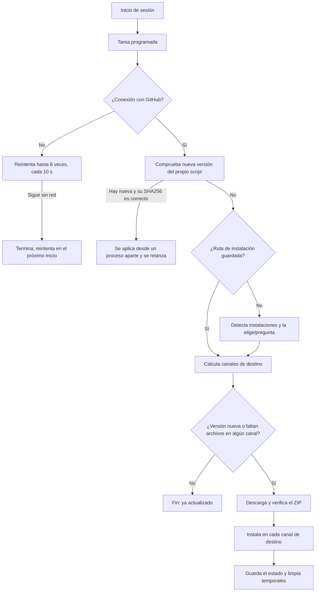

# 🌐 Star Citizen - Traducción al Español (Sistema de Auto-Actualización)

<div align="center">


**Mantiene al día la traducción al español de Star Citizen sin que tengas que hacer nada**

[🚀 Instalación](#-instalación) · [🎮 Canales](#-canales-del-juego-live-hotfix-ptu-y-eptu) · [🔍 Detección](#-cómo-encuentra-el-juego) · [❓ FAQ](#-preguntas-frecuentes) · [🐛 Problemas](#-solución-de-problemas) · [🧑‍💻 Desarrollo](#-desarrollo)

</div>

---

## 📋 ¿Qué es esto?

Un pequeño sistema (un instalador, un script y una tarea programada de Windows) que descarga e instala en tu juego la traducción al español de la comunidad ([Thord82/Star_citizen_ES](https://github.com/Thord82/Star_citizen_ES)) cada vez que se publica una versión nueva.

- ✅ **Encuentra el juego solo**, en cualquier disco y aunque lo tengas en una biblioteca personalizada.
- ✅ **Se ejecuta al iniciar sesión** en segundo plano y espera a que haya red si todavía no la hay.
- ✅ **Solo descarga cuando hay una versión nueva** (o cuando falta la traducción, por ejemplo tras reinstalar el juego).
- ✅ **Soporta LIVE, HOTFIX, PTU y EPTU.** LIVE y HOTFIX automáticamente; PTU y EPTU solo si tú lo confirmas.
- ✅ **Se mantiene a sí mismo al día** mediante las releases de este repositorio, verificando su integridad.
- ✅ **Guarda un log** de todo lo que hace.

---

## 🚀 Instalación

1. **Descarga** [`InstalarAutoUpdate.bat`](https://github.com/Raksiusdev/SC-LangUPD_ES/raw/main/InstalarAutoUpdate.bat).
2. **Clic derecho → "Ejecutar como administrador".**
3. Sigue las indicaciones. Al terminar pulsa Enter para lanzar la primera actualización.

El instalador, en orden:

```
[1/4] Verificando conexión a internet...
[2/4] Creando carpeta de scripts...            (C:\Scripts)
[3/4] Descargando script desde GitHub...       (la última release publicada)
[4/4] Configurando tarea programada...         (UpdateStarCitizenES, al iniciar sesión)
      ...y ejecuta la primera actualización, visible en la consola
```

Durante esa primera ejecución, y **solo entonces**, te puede preguntar:

- **Qué instalación usar**, si detecta más de una.
- **La ruta de la carpeta del juego**, si no consigue encontrarla.
- **Si quieres instalar también en PTU / EPTU**, si tienes esos canales (ver [Canales](#-canales-del-juego-live-hotfix-ptu-y-eptu)).

Las ejecuciones posteriores (tarea programada) son silenciosas y reutilizan tus respuestas.

> Para actualizar el sistema no hace falta reinstalar: el script se autoactualiza ([cómo](#-auto-actualización-del-propio-script)). Si quieres cambiar tus respuestas (instalación, PTU/EPTU), vuelve a ejecutar el instalador.

---

## 🎮 Canales del juego: LIVE, HOTFIX, PTU y EPTU

Una instalación de Star Citizen puede tener varios canales en paralelo, cada uno en su subcarpeta. El script instala la traducción **solo en los que existen realmente** en tu instalación:

| Canal | Qué hace el script | Textos que instala |
|-------|--------------------|--------------------|
| **LIVE** | Instala y actualiza automáticamente | los de LIVE |
| **HOTFIX** | Instala y actualiza automáticamente | los de LIVE |
| **PTU** | **Pregunta** una vez y recuerda la respuesta | los de PTU (el ZIP trae un `global.ini` específico) |
| **EPTU** | **Pregunta** una vez y recuerda la respuesta | los de PTU (el ZIP no trae EPTU; es lo más cercano) |

### ⚠️ Aviso sobre PTU y EPTU

PTU y EPTU son versiones de prueba con contenido nuevo en desarrollo. La traducción puede no incluir todavía los textos más recientes, así que **puede que veas claves sin traducir o textos en inglés** en esos canales. Por eso el instalador te lo explica y te pide confirmación antes de instalar:

```
================================================================
  Canal PTU detectado en esta instalacion
================================================================
  AVISO: PTU y EPTU son versiones de pruebas con contenido nuevo
  ...
Instalar la traduccion tambien en PTU? (S/N) [N]:
```

- Responder **N** (o Enter) significa que no se instala ni se actualiza en ese canal.
- La decisión se guarda en `Star_citizen_ES_state.txt` (clave `PREVIEW_ON`). Las ejecuciones en segundo plano **nunca** instalan en PTU/EPTU sin una confirmación previa; si detectan un canal sin decidir, lo dejan anotado en el log.
- Para cambiar de opinión, vuelve a ejecutar `InstalarAutoUpdate.bat`: te preguntará de nuevo. Si dices que no a un canal donde ya estaba instalada, los archivos que ya existen **no se borran**; para quitarla elimina `data\Localization\spanish_(spain)` y `user.cfg` dentro de la carpeta de ese canal.
- Un canal solo cuenta como instalado si tiene `Data.p4k` o `Bin64\StarCitizen.exe`, así que carpetas vacías (por ejemplo una `PTU` creada por versiones antiguas de este script) se ignoran.

### Qué se copia en cada canal

La traducción trae dos archivos por canal:

- `data\Localization\spanish_(spain)\global.ini`: los textos.
- `user.cfg`: fija `g_language = spanish_(spain)`, `g_languageAudio = english` y `r_DepthOfField = 0` (desactiva el desenfoque de profundidad). **Este archivo sobrescribe tu `user.cfg`** de ese canal; si tenías ajustes propios, vuelve a añadirlos después de la primera instalación (las siguientes actualizaciones solo lo reescriben cuando hay una versión nueva).

---

## 🔍 Cómo encuentra el juego

El script detecta las instalaciones **por capas** y se queda con todas las que encuentre:

1. **Log del RSI Launcher** (`%APPDATA%\rsilauncher\logs`): el launcher anota la ruta real desde la que lanza el juego, así que cubre bibliotecas en cualquier carpeta o disco.
2. **Rutas habituales** en todos los discos:
   ```
   [Disco]:\Program Files\Roberts Space Industries\StarCitizen\
   [Disco]:\Program Files (x86)\Roberts Space Industries\StarCitizen\
   [Disco]:\StarCitizen\
   [Disco]:\Roberts Space Industries\StarCitizen\
   [Disco]:\Games\StarCitizen\
   [Disco]:\Games\Roberts Space Industries\StarCitizen\
   ```
3. **Escaneo de discos** (hasta 4 niveles, solo si lo anterior no encontró nada) buscando carpetas llamadas `StarCitizen`. Ignora `Windows`, `AppData`, `ProgramData` y similares.

Una carpeta cuenta como instalación si contiene un canal (`LIVE`, `HOTFIX`, `PTU` o `EPTU`) con `Data.p4k` o `Bin64\StarCitizen.exe` (o si el propio launcher indica que ha lanzado el juego desde ahí).

**Cuándo se detecta.** Solo cuando no hay una ruta guardada válida. Una vez elegida, la instalación se guarda (`INSTALL_PATH` en `Star_citizen_ES_state.txt`) y las siguientes ejecuciones no vuelven a buscar.

**Si no se encuentra nada**, el instalador te pide la ruta (la carpeta que contiene `LIVE`, por ejemplo `D:\Juegos\StarCitizen`; si pegas la de un canal, sube un nivel solo) y la guarda. Las ejecuciones en segundo plano **no instalan nada** si no hay ruta: lo dejan escrito en el log y terminan con código 1.

> El log del launcher se lee del usuario que ejecuta el script. Si ejecutas el instalador con otra cuenta de administrador esa fuente no estará disponible y se usarán las otras dos.

### ¿Tienes el juego instalado más de una vez?

- En el **instalador** te muestra la lista y eliges cuál usar; se guarda en el estado.
- Las **actualizaciones automáticas** usan siempre esa instalación guardada.
- Si no has elegido ninguna y el script corre en segundo plano, usa la primera que encuentre y lo anota en el log (la del log del launcher va primero).
- Para cambiar de instalación, borra `%USERPROFILE%\Star_citizen_ES_state.txt` y vuelve a ejecutar el instalador.

---

## 📁 ¿Qué se instala?

| Archivo / elemento | Ubicación | Descripción |
|--------------------|-----------|-------------|
| `UpdateStarCitizenES.bat` | `C:\Scripts\` | El script de actualización |
| `SC_Lang_updater.vbs` | `C:\Scripts\` | Lanzador que ejecuta el script sin mostrar ventana |
| Tarea programada `UpdateStarCitizenES` | Programador de tareas | Ejecuta el lanzador al iniciar sesión |
| `Star_citizen_ES_update_log.txt` | `%USERPROFILE%\` | Log (se purga a las últimas 500 líneas en cada ejecución) |
| `Star_citizen_ES_state.txt` | `%USERPROFILE%\` | Estado: versión de la traducción instalada (`RELEASE`), instalación elegida (`INSTALL_PATH`), hash SHA256 del último ZIP (`ZIP_SHA256`) y canales de prueba aceptados (`PREVIEW_ON`) |

---

## ✅ Verificar que funciona

### Ver el log

```cmd
notepad %USERPROFILE%\Star_citizen_ES_update_log.txt
```

Cada línea es `[hora] [NIVEL] mensaje`, con niveles `INFO`, `OK`, `WARN` o `ERROR`. Una ejecución normal sin novedades:

```
========================================
Inicio: 04/10/2026 12:36:46,22
========================================
[12:36:46,91] [INFO] El script ya esta actualizado (version 0.4.0)
[12:36:47,02] [INFO] Usando instalacion guardada: C:\Program Files\Roberts Space Industries\StarCitizen
[12:36:47,10] [INFO] Canales de destino: LIVE HOTFIX
[12:36:47,50] [INFO] Ultima release remota: 4.10.10.00
[12:36:47,51] [OK] Archivos de traduccion encontrados en todos los canales de destino
[12:36:47,52] [OK] Ya actualizado (version 4.10.10.00)
========================================
```

Y una instalación con descarga:

```
[12:21:44,76] [INFO] RAZON: faltan archivos de traduccion en: LIVE PTU, descargando...
[12:21:46,26] [INFO] SHA256 del ZIP: 7E0AAC4B...
[12:21:47,31] [INFO] Instalando traduccion en el juego...
[12:21:47,33] [OK] Traduccion instalada en el canal LIVE (origen: LIVE)
[12:21:47,35] [OK] Traduccion instalada en el canal PTU (origen: PTU)
[12:21:47,38] [OK] Version instalada: 4.10.10.00
```

### Ejecutar manualmente

```cmd
schtasks /run /tn "UpdateStarCitizenES"
```

o directamente `C:\Scripts\UpdateStarCitizenES.bat`.

---

## 🛠️ Gestión del sistema

```cmd
:: Estado de la tarea
schtasks /query /tn "UpdateStarCitizenES" /fo LIST /v

:: Desactivar / reactivar temporalmente
schtasks /change /tn "UpdateStarCitizenES" /disable
schtasks /change /tn "UpdateStarCitizenES" /enable

:: Desinstalar (la traducción ya instalada en el juego no se borra)
schtasks /delete /tn "UpdateStarCitizenES" /f
del C:\Scripts\UpdateStarCitizenES.bat
del C:\Scripts\SC_Lang_updater.vbs
```

Para reinstalar o cambiar tus respuestas, vuelve a ejecutar `InstalarAutoUpdate.bat` como administrador: sobrescribe lo anterior.

---

## 🔄 Cómo funciona


```mermaid
graph TD
    A[Inicio de sesión] --> B[Tarea programada]
    B --> C{¿Conexión con GitHub?}
    C -->|No| C2[Reintenta hasta 6 veces, cada 10 s]
    C2 -->|Sigue sin red| Z[Termina; reintenta en el próximo inicio]
    C -->|Sí| D[Comprueba nueva versión del propio script]
    D -->|Hay nueva y su SHA256 es correcto| D2[Se aplica desde un proceso aparte y se relanza]
    D -->|No| E{¿Ruta de instalación guardada?}
    E -->|No| F[Detecta instalaciones y la elige/pregunta]
    E -->|Sí| G[Calcula canales de destino]
    F --> G
    G --> H{¿Versión nueva o faltan archivos en algún canal?}
    H -->|No| Y[Fin: ya actualizado]
    H -->|Sí| I[Descarga y verifica el ZIP]
    I --> J[Instala en cada canal de destino]
    J --> K[Guarda el estado y limpia temporales]
```

### Detección de versiones de la traducción

1. Consulta `https://api.github.com/repos/Thord82/Star_citizen_ES/releases/latest`.
2. Compara con la `RELEASE` guardada en `Star_citizen_ES_state.txt`.
3. Si es distinta, o falta `global.ini` en algún canal de destino, descarga e instala. Si no, termina.

### Verificación del ZIP descargado

Antes de instalar comprueba que el ZIP no esté vacío o incompleto, calcula su SHA256 (se guarda en el estado y en el log, útil para soporte) y verifica que el contenido extraído incluya `global.ini`. Si algo falla se aborta sin tocar la traducción existente. Thord82 no publica un checksum oficial, así que esto detecta descargas corruptas pero no puede verificar la autenticidad del contenido.

### 🔁 Auto-actualización del propio script

El script se mantiene al día con las **releases publicadas** de este repositorio (no con commits sueltos de `main`: solo lo que se marca explícitamente como release). En cada ejecución, si hay una release más reciente que su `SCRIPT_VERSION`:

1. Descarga `UpdateStarCitizenES.bat` y `SC_Lang_updater.vbs` de ese tag.
2. Comprueba que el `.bat` sea válido y **verifica los hashes SHA256** contra el `SHA256SUMS.txt` que publica la release. Si no coinciden, descarta la actualización. Si una release antigua no lo publica, continúa y lo anota en el log. *Esto protege de descargas corruptas o truncadas; no protege frente a un repositorio comprometido, porque los hashes salen del mismo repositorio.*
3. Lo aplica desde un proceso auxiliar independiente, sin que el script se sobrescriba mientras se ejecuta, y se relanza ya actualizado. El proceso original termina antes de que se copie el archivo, y una protección evita bucles de actualización.
4. Todo queda en el log.

Si no hay conexión o falla la descarga, sigue con la versión actual sin interrumpir la actualización de la traducción.

---

## ❓ Preguntas frecuentes

### ¿Necesito configurar algo?
No. Ejecuta el instalador como administrador y responde a lo que te pregunte la primera vez.

### ¿Funciona con PTU, EPTU o HOTFIX?
Sí. HOTFIX se instala automáticamente cuando existe. PTU y EPTU solo si tú lo confirmas, porque son versiones de prueba y puede que falten textos nuevos. Ver [Canales](#-canales-del-juego-live-hotfix-ptu-y-eptu).

### ¿Detecta dónde tengo el juego?
Sí, por capas (log del launcher, rutas habituales y escaneo de discos). Si no lo encuentra, el instalador te pide la ruta. Ver [Cómo encuentra el juego](#-cómo-encuentra-el-juego).

### ¿Qué pasa si no hay internet al iniciar Windows?
La tarea espera y reintenta hasta 6 veces (cada 10 segundos). Si sigue sin conexión, termina sin error y lo vuelve a intentar en el siguiente inicio de sesión.

### ¿Qué pasa si ya está actualizado?
Comprueba la versión en GitHub y termina sin descargar nada.

### ¿Consume muchos recursos?
No. Tarda unos segundos y solo descarga cuando hay una versión nueva. El resto del tiempo no hay nada en ejecución.

### ¿Afecta al rendimiento del juego?
No: son archivos de texto de traducción. Ojo con `user.cfg`: el de la traducción desactiva `r_DepthOfField` (desenfoque de profundidad) y deja el audio en inglés, y **sobrescribe el tuyo**. Ver [Qué se copia en cada canal](#qué-se-copia-en-cada-canal).

### ¿Puedo desactivarlo temporalmente?
```cmd
schtasks /change /tn "UpdateStarCitizenES" /disable
schtasks /change /tn "UpdateStarCitizenES" /enable
```

### ¿Es seguro?
El código es abierto y auditable. Solo descarga desde el repositorio de la traducción ([Thord82](https://github.com/Thord82/Star_citizen_ES)) y desde las releases de este repositorio (los scripts, con verificación de hashes). El instalador necesita administrador únicamente para crear la tarea programada y escribir en `C:\Scripts`.

### ¿Qué pasa si borro archivos por accidente?
Vuelve a ejecutar el instalador (o `schtasks /run /tn "UpdateStarCitizenES"` si solo faltan archivos de la traducción: se detecta y se reinstalan).

### ¿Tengo que ejecutarlo cada vez que inicio Windows?
No, se ejecuta solo al iniciar sesión.

---

## 🐛 Solución de problemas

### El instalador dice "Necesita ejecutarse como Administrador"
Clic derecho en `InstalarAutoUpdate.bat` → **Ejecutar como administrador**.

### No encuentra Star Citizen
**Causas:** biblioteca en una ubicación no estándar, o instalación sin `Data.p4k` (descarga incompleta).

1. Ejecuta de nuevo `InstalarAutoUpdate.bat` como administrador.
2. Si no lo detecta, te pedirá la ruta: la carpeta que contiene `LIVE` (p. ej. `D:\Juegos\StarCitizen`).
3. Revisa el log: lista qué instalaciones encontró.

### No se ha instalado nada en PTU / EPTU
Es lo esperado hasta que lo confirmes. Ejecuta el instalador de nuevo y responde **S** cuando pregunte por ese canal. En el log aparece `Canal PTU detectado pero sin confirmar`.

### En PTU veo claves sin traducir o textos en inglés
Es el aviso del instalador: el contenido de PTU/EPTU va por delante de la traducción. Se resuelve cuando la comunidad la actualiza (se instalará sola en la siguiente versión).

### Error "No se pudo obtener la versión de GitHub"
Sin conexión, GitHub caído o un firewall bloqueando.

```cmd
curl https://api.github.com/repos/Thord82/Star_citizen_ES/releases/latest
```

### La tarea no se ejecuta al iniciar sesión
```cmd
schtasks /query /tn "UpdateStarCitizenES" /fo LIST /v
```

Para recrearla (como administrador):
```cmd
schtasks /delete /tn "UpdateStarCitizenES" /f
schtasks /create /tn "UpdateStarCitizenES" /tr "wscript.exe \"C:\Scripts\SC_Lang_updater.vbs\"" /sc onlogon /rl highest /f
```
(o simplemente vuelve a ejecutar el instalador).

### Error al descargar o extraer archivos
Mira el log. Errores comunes:
- `[ERROR] Fallo la descarga` → conexión o espacio en disco.
- `[ERROR] Fallo al expandir el archivo` → ZIP corrupto; se reintentará en la siguiente ejecución.
- `[ERROR] Fallo al copiar la traduccion en el canal X` → falta de permisos o archivos en uso (cierra el juego y el launcher); se reintenta solo.

### Quiero que me ayuden: ¿qué incluyo en el issue?
El contenido del log, tu versión de Windows, dónde tienes instalado el juego y el mensaje de error exacto.

---

## 💻 Desarrollo

### Ramas y releases

- `dev`: integración. `main`: la base de las releases y el archivo del instalador que descargan los usuarios nuevos.
- **Los usuarios reciben el código de las releases**, no el de `main`: el instalador descarga los scripts del **tag de la última release**, igual que la autoactualización. Un merge a `main` sin release no llega a nadie.

Para publicar una versión:

1. Mergea a `main` y pon `SCRIPT_VERSION` en `UpdateStarCitizenES.bat` igual al número del tag (`0.4.0` para `v0.4.0`).
2. Publica la release: `gh release create v0.4.0 --target main --generate-notes`.
3. La acción [`release-checksums`](.github/workflows/release-checksums.yml) adjunta `SHA256SUMS.txt` automáticamente.
4. Los equipos con una versión anterior se actualizan solos en su siguiente ejecución.

### Probar una rama sin publicar nada

1. Descarga `InstalarAutoUpdate.bat` desde la rama: `https://github.com/Raksiusdev/SC-LangUPD_ES/raw/dev/InstalarAutoUpdate.bat`.
2. Edita el archivo y cambia `set "SCRIPT_REF=release"` por `set "SCRIPT_REF=dev"` (descargará los scripts de esa rama).
3. Ejecútalo como administrador. Antes de pulsar Enter en "PULSA ENTER PARA EJECUTAR PRIMERA ACTUALIZACIÓN", abre `C:\Scripts\UpdateStarCitizenES.bat` y cambia `set "SCRIPT_VERSION=dev"` por la versión de la última release (la autoactualización solo confía en releases y te revertiría).
4. Pulsa Enter y revisa `%USERPROFILE%\Star_citizen_ES_update_log.txt` y `%USERPROFILE%\Star_citizen_ES_state.txt`.

### Tests

Los tests viven en [`tests/`](tests) y corren en GitHub Actions ([`tests.yml`](.github/workflows/tests.yml)) en cada push y pull request. En local:

```powershell
powershell -ExecutionPolicy Bypass -File tests\run-all.ps1            # todos
powershell -ExecutionPolicy Bypass -File tests\run-all.ps1 -SinRed    # sin los que descargan la traducción
```

| Test | Qué cubre | Red |
|------|-----------|-----|
| `Test-Detection.ps1` | Detección por capas: log del launcher, rutas conocidas, escaneo, límite de profundidad, descarte de carpetas sueltas | No |
| `Test-SelfUpdateIntegrity.ps1` | Verificación SHA256 de la autoactualización (coincide / no coincide / sin archivo de hashes) | No |
| `Test-Flows.ps1` | Flujos completos sobre instalaciones simuladas: sin instalación, ruta manual, varios canales con confirmación de PTU/EPTU, reparación, reintento sin red | Sí |

Todo ocurre en carpetas temporales: los tests aíslan `USERPROFILE`, `APPDATA` y las raíces de búsqueda, así que no tocan tu instalación real.

### Ideas futuras

- Soporte de `TECH-PREVIEW` como canal opcional.
- Opción de desinstalar la traducción de un canal desde el instalador.

---

## 👥 Créditos

- **Traducción:** [Thord82](https://github.com/Thord82) - [Star_citizen_ES](https://github.com/Thord82/Star_citizen_ES)
- **Sistema de actualización:** [Raksiusdev](https://github.com/Raksiusdev)
- **Comunidad Star Citizen ES**, por el apoyo y el feedback.

## 📜 Licencia

MIT. Ver [LICENSE](LICENSE).

## 🔗 Enlaces útiles

- 🎮 [Star Citizen](https://robertsspaceindustries.com/)
- 💬 [Comunidad Star Citizen España](https://discord.gg/starcitizenes)
- 📖 [Repositorio de la traducción](https://github.com/Thord82/Star_citizen_ES)
- 🐛 [Reportar problemas](https://github.com/Raksiusdev/SC-LangUPD_ES/issues)
- 📚 [Issue Council (RSI)](https://issue-council.robertsspaceindustries.com/)

---

<div align="center">

**¿Te ha sido útil?** ⭐ Dale una estrella al repositorio · **¿Problemas?** 🐛 [Abre un issue](https://github.com/Raksiusdev/SC-LangUPD_ES/issues) · **¿Quieres contribuir?** 🤝 Los Pull Requests son bienvenidos

Hecho con ❤️ por la comunidad de Star Citizen España

</div>
